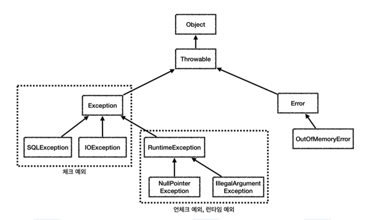

# 예외
## 예외계층

- `Throwable` : 최상위 예외. 하위에 Exception, Error가 있음.
- `Error`(unchecked) : 메모리 부족이나 심각한 시스템 오류와 같이 애플리케이션에서 복구 불가능한 시스템 예외.
  - 이 예외를 잡으려하면 안됨.
- `Exception` : <u>체크 예외</u>
  - 애플리케이션 로직에서 사용할 수 있는 실질적인 최상위 예외.
  - `Exception` 과 그 하위 예외는 모두 컴파일러가 체크하는 체크 예외. 단 `RuntimeException` 은 제외.
- `RuntimeException` : <u>언체크 예외, 런타임 예외</u>
  - 컴파일러가 체크 하지 않는 언체크 예외.
  - `RuntimeException` 과 그 자식 예외는 모두 언체크 예외.

## 예외 기본 규칙
### 예외 처리
- 예외를 처리하면 정상 흐름으로 동작
### 예외 던짐
- 예외 처리를 하지 못하면 호출한 곳으로 예외를 계속 던짐.
- 계속 던져질 경우, was의 경우 예외 페이지를 보여주고, main 스레드의 경우 시스템 종료
> 예외는 잡아서 처리하거나 던져야함.
> - 잡거나 던질 경우, 그 자식들도 함께 처리됨.

## 체크 예외
- 잡아서 처리하거나, 밖으로 던지도록 선언해야함.
- Exception을 상속받은 예외는 체크 예외가 됨.
```java
public class MyCheckedException extends Exception {
	public MyCheckedException(String message) {
		super(message);
	}
}
```
- 생성자를 통해 오류 메시지를 보관 가능.

**체크 예외를 잡아서 처리**
```java
try {
      repository.call();
} catch (MyCheckedException e) { 
    //예외 처리 로직
}

try {
	repository.call();
} catch (Exception e) {
	// MyCeckedExcpetion도 예외 처리 됨.
}
```

**체크 예외를 밖으로 던짐.**
```java
public void callThrow() throws MyCheckedException {
      repository.call();
}

public void callThrow() throws Exception {
	repository.call();
}
```
- 체크 예외를 밖으로 던지지 않으면 컴파일 오류 발생.
- throws에 지정한 타입과 그 하위 타입 예외를 밖으로 던짐.

### 체크 예외 장단점
체크 예외는 예외를 잡아서 처리할 수 없을 경우, throws를 통해 필수로 예외를 던져야함
- 장점: 개발자가 실수로 예외를 누락사지 않도록 컴파일러르 통해 잡아주는 안전장치 역할
- 단점: 모든 체크 예외를 반드시 잡거나 던져야하기 때문에, 너무 번거로움


## 언체크 예외 기본
- 컴파일러가 예외를 체크하지 않음.
- throws를 선언하지 않고, 생략할 수 있음.
  - 자동으로 예외를 던짐

**언체크 예외를 잡아서 처리하는 코드**
```java
try {
      repository.call();
} catch (MyUncheckedException e) { 
      log.info("error", e);
}
```
- 필요한 경우 잡아서 처리 가능.

**언체크예외를 밖으로 던지는 코드**
```java
public void callThrow() throws MyUncheckedException {
      repository.call();
}
```
- 생략 가능하지만 던질 수도 있음
- 중요한 예외의 경우 선언해두면 해당 코드를 호출하는 개발자가 예외가 발생하다는 점을 IDE를 통해 편리하게 가능(컴파일 시점 x)

### 언체크 예외 장단점
- 장점: 신경쓰지 않고 싶은 예외 무시 가능
- 단점: 실수로 예외를 누락할 수 있음.

## 체크 예외 활용
- 기본적으로 언체크 예외를 활용함.
- <u>체크 예외는 비지니스 로직상 의도적으로 던지는 예외에만 사용</u>
  - 해당 예외를 잡아서 반드시 처리해야 하는 문제일 경우 체크 예외를 사용해야함.
    - 계좌이체 실패
    - 결제시 포인트 부족
    - id.pw 불일치
  - 이것도 무조건 체크 예외로 만들어야하는 것은 아니지만, 매우 심각한 문제는 개발자가 실수로 예외를 놓치면 안된다고 판단할 수 있는 경우 체크 예외로 만듦.

### 체크 예외의 문제점
- 복구불가능한 예외
- 의존 관계에 대한 문제
#### 복구 불가능한 예외
대부분의 예외는 복구가 불가능
- `SQLException`는 데이터베이스에 무언가 문제가 있어서 발생하는 예외. 
  - SQL 문법에 문제, 데이터베이스 자체에 뭔가 문제, 데이터베이스 서버가 중간에 다운 되었을 수도 있음. 이런 문제들은 대부분 복구가 불가능
#### 의존 관계 문제
복구 불가능함에도 불구하고 체크 예외이기 때문에 어쩔 수 없이 throws를 통해 예외를 던져야함.
- 이렇게 되면, 서비스, 컨트롤러에서 체크예외에 의존하게됨(SQLException).
- 유지 보수가 힘들어짐.

> 실무에서 발생하는 대부분의 예외는 복구 불가능한 시스템예외 -> 체크 예외를 사용하면 서비스, 컨트롤러에서 체크 예외를 알고있어야 하기 때문에 불필요한 의존관계 발생

**Exception을 던졌을 경우**
```java
void method() throws Exception {..}
```
- Exception은 최상위 타입이므로 모든 체크 예외를 다 밖으로 던짐
- 다른 체크 예외를 체크할 수 있는 기능이 무효화됨.

## 언체크 예외 활용
- 체크 예외를 런타임 예외로 전환시켜 throws를 생략 가능.
- 시스템에서 발생하는 예외는 대부분 복구 불가능하므로 런타임 예외를 사용하면 이러한 복구 불가능한 예외를 신경쓰지 않아도 됨.

### 런타임 예외 문서화
- 런타임 예외는 문서화를 잘 해야함
- 또는 throws를 사용하여 중요한 예외를 인지하게 할 수 있게 해줘야함.
```java
  /**
   * Make an instance managed and persistent.
   * @param entity  entity instance
   * @throws EntityExistsException if the entity already exists.
   * @throws IllegalArgumentException if the instance is not an
   *         entity
   * @throws TransactionRequiredException if there is no transaction when
   *         invoked on a container-managed entity manager of that is of type
   *         <code>PersistenceContextType.TRANSACTION</code>
   */
public void persist(Object entity);
```

## 예외 포함 스택 트레이스
- 예외를 전환할 경우 기존 예외를 꼭 포함해야함.
```java
try {
	controller.request();
} catch (Exception e) {
	//e.printStackTrace();
    log.info("ex", e);
}

public void call() {
	try {
		runSQL();
	} catch (SQLException e) {
		throw new RuntimeSQLException(e); //기존 예외(e) 포함 }
	}
}
```

## 체크 예외와 인터페이스
```java
public interface MemberRepositoryEx {
      Member save(Member member) throws SQLException;
      Member findById(String memberId) throws SQLException;
      void update(String memberId, int money) throws SQLException;
      void delete(String memberId) throws SQLException;
}

```
- 인터페이스의 구현체가 체크 예외를 던지려면, 인터페이스 메서드에 먼저 체크 예외를 던지는 부분이 선언돼야함.
  - 구현체에서 선언할 수 있는 예외는 선언된 예외와 같거나 하위 타입이어야함.

> 인터페이스가 특정 기술에 종속됨.
>

## 런타임 예외와 인터페이스
인터페이스에 런타임 예외를 따로 선언하지 않아도 되므로 특정 기술에 종속적일 필요가 없음.

## 스프링 예외 추상화
- 스프링은 데이터 접근 계층에 대한 수십 가지 예외를 정리해서 일관된 예외 계층 제공
- 각 예외는 특정 기술에 종속적이지 않게 설계

### 예외 변환기
데이터베이스에서 발생하는 오류 코드를 스프링이 정의한 예외로 자동으로 변환해주는 변환기


